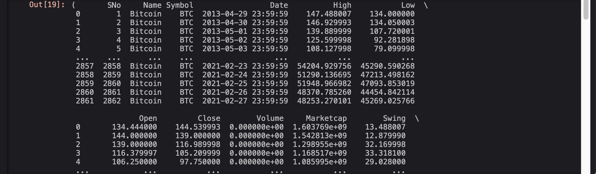
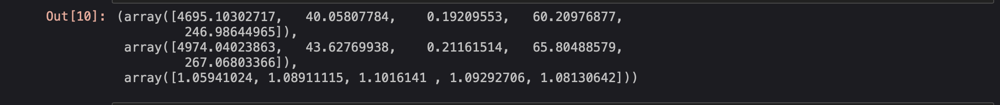
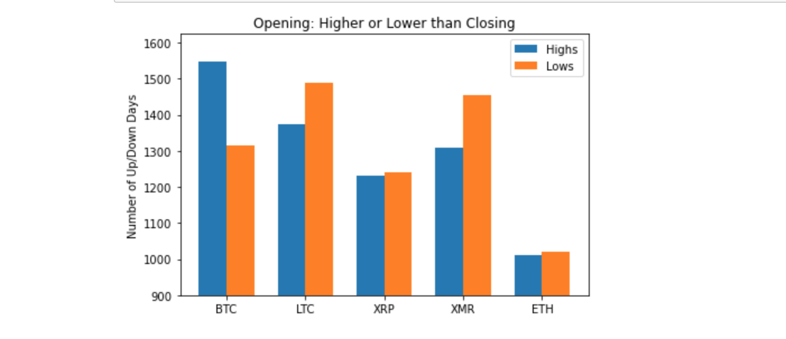

### CryptoPrices
Exploratory Data Analysis around BTC and other cryptocurrencies

## Introduction

Cryptocurrency, a digital asset designed to work as a medium of exchange, is far from a new concept. In 1983 eCash was a published & established concept: eCash software on a user's machine could store digital money which was cryptographically signed by a bank. The user could then spend the digital money at an accepting vendor without having to open any vendor accounts or sharing any payment information like credit card numbers. By 1990 eCash was 'off-line' meaning payees no longer had to contact a third party (i.e, The Bank). Exactly one (1) U.S. Bank accepted eCash as a micropayment system, before scrapping it completely a few years later, when it was picked up by Credit Suisse, Deutsche Bank, Bank Austria, and others until eCash went bankrupt in 1998, unable to compete with credit cards.

When Bitcoin was released over a decade later in 2009, it was the world's first decentralized crypocurrency -- lacking an organizational or authoritative controlling body -- and put simply, an asset which may only be accessed by its key-holder.

The history lesson ends here, however. We will be examining price data from Bitcoin/BTC (2009) along with a few others that emerged years afterwards: Litecoin/LTC (2011, Ripple/XRP (2013), Monero/XMR (2014), and Etherium/ETH (2015). To state the obvious, this is in no way a *comparison* across these cryptocurrencies. Their only similarities, for the purposes of this exercise, is that they're digital assets that have a fluctuating USD value.

We will examine the individual price data and their movement to look for correlations beween the coins.

## The Data

Because most crypocurrencies are bound to a blockchain - a public ledger of records - there is a considerable amount of data available for examination. The dearth of data held by the [Blockchain.info API](https://www.blockchain.com/charts) was too much for now but may hopefully provide more data for future projects.
We used a cleaned dataset from [Sudalai Raj Kumar](https://www.kaggle.com/sudalairajkumar/cryptocurrencypricehistory) which provides a clean daily breakdown of Open/Close prices, Highs/Lows, daily trade volume and market cap among 20+ cryptocurencies. These simple, straightforward, value-focused metrics should hopefully be easy to digest and allow us to really understand our dataset.

- First we'll make the necessary imports and read in the data.

```python
import pandas as pd
import numpy as np
from scipy import stats
import matplotlib.pyplot as plt
import seaborn as sns
```

```python
btc = pd.read_csv('coin_Bitcoin.csv')  #read each csv data file into a pandas df
btc['Swing'] = btc['High'] - btc['Low']  #adding a col "Swing" to show the difference between the daily high/low
btc['Percent'] = btc['High'] / btc['Low'] #adding another col "Percent" to show the quotient of daily high/low prices
btc                                        # variable for the Bitcoin pandas df with its added columns is called
```


- A look at the Bitcoin dataframe is shown above. You'll see two indexes (0- and 1-index), 'Name', 'Symbol', 'Date', 'High'/'Low', 'Open'/'Close', 'Volume', & 'Marketcap', along with the daily 'Swing' and its corresponding 'Percent' now ready for examination. This pandas dataframe contains 2862 rows × 12 columns holding daily data from 04/29/2013 to 2/27/2021.

```python
coins = btc, ltc, xrp, xmr, eth      #variable that holds all data for the 5 dataframes

coins
```




- With dataframes for BTC, LTC, XRP, XMR, & ETH loaded, our analysis can begin. First thing we examined was the average price points. We looked at the average highs and the lows, examining their variance and giving us an initial look into our different cryptocurrencies.

```python
def getavgl(data):
    avgs = []
    for x in data:
        avgs.append(np.mean(x['Low']))
    return avgs

def getavgh(data):
    avgs = []
    for x in data:
        avgs.append(np.mean(x['High']))
    return avgs
```

```python
avglows = np.array(getavgl(coins))
avghighs = np.array(getavgh(coins))
avgspread = avglows/avghighs
avglows, \
avghighs, \
avgspread
```



- Ignoring the obvious price differences, we can already see clear variances in their respective volatilities, with Ripple/XRP having the most variation between average highs/lows (.9) with Bitcoin/BTC having the least variation from average highs/lows (.95). Interesting... isn't Bitcoin supposed to be the "wildly unstable" asset?


- Let's take another angle. Let's examine each days' 'Open' and 'Close' value and note if 'Close' is higher or lower than its 'Open'.

```python

def higherlower(df):
    higher = 0  #counting days where the price was higher at close than at open
    lower = 0   #counting days where the price was lower at close than at open
    for index, row in df.iterrows():
        if df.loc[index,'Close'] > df.loc[index,'Open']:
            higher += 1
        elif df.loc[index,'Close'] == df.loc[index,'Open']: #ignore this unlikely scenario
            pass
        else:
            lower +=1
    return higher, lower, higher/lower

```
```python
a = higherlower(btc)
b = higherlower(ltc)
c = higherlower(xmr)
d = higherlower(xrp)
e = higherlower(eth)

a,b,c,d,e
```





- Several things become fairly apparent here. From this data we can see Bitcoin/BTC has the highest rate of "higher" days while Ripple/XRP has the least of the group.
- The next biggest and most obvious is regarding the data; the price have start dates ranging from 2013 to 2015, if we're going to start examining the prices and their movements, we should probably trim everything down so that each row of each dataframe corresponds to the same date.
    - In order to do this, we have to trim down to size of our shortest list, our newest crypocurrency, Etherium, where the data begins collection on 08/08/2015 and contains 2031 rows.

```python
# lets trim all our df down to magic len=2031.
btctrim= btc['Low'].iloc[831:]
ltctrim = ltc['Low'].iloc[831:]
xrptrim = xrp['Low'].iloc[733:]
xmrtrim = xmr['Low'].iloc[442:]
ethtrim = eth['Low']
```

- Then we went to correlation country. Computing the Pearson correlations of price movements yeilded the following:


BTC          | LTC         | XRP         | XMR          | ETH
------------ | ----------- | ----------- | ------------ | ---
1.000000  |	0.688128   |	0.421084    |	0.606872   |	0.862465|
0.688128  |	1.000000   |	0.827995    |	0.939251   | 	0.843916|
0.421084  |	0.827995   |	1.000000    |	0.877312   |	0.674485|
0.606872  |	0.939251   |	0.877312    |	1.000000   |	0.826711|
0.862465  |	0.843916   |	0.674485    |	0.826711   |	1.000000|


