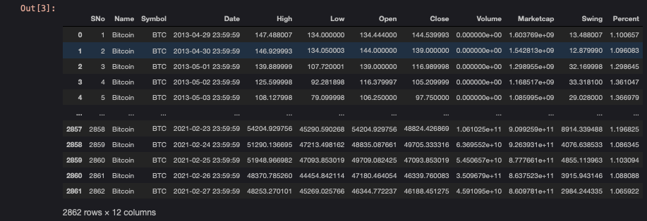

# CryptoPrices
Exploratory Data Analysis around BTC and other cryptocurrencies

# Introduction

Cryptocurrency, a digital asset designed to work as a medium of exchange, is far from a new concept. In 1983 eCash was a published & established concept: eCash software on a user's machine could store digital money which was cryptographically signed by a bank. The user could then spend the digital money at an accepting vendor without having to open any vendor accounts or sharing any payment information like credit card numbers. By 1990 eCash was 'off-line' meaning payees no longer had to contact a third party (i.e, The Bank). Exactly one (1) U.S. Bank accepted eCash as a micropayment system, before scrapping it completely a few years later, when it was picked up by Credit Suisse, Deutsche Bank, Bank Austria, and others until eCash went bankrupt in 1998, unable to compete with credit cards.

When Bitcoin was released over a decade later in 2009, it was the world's first decentralized crypocurrency -- lacking an organizational or authoritative controlling body -- and put simply, an asset which may only be accessed by its key-holder.

The history lesson ends here, however. We will be examining price data from Bitcoin/BTC (2009) along with a few others that emerged years afterwards: Litecoin/LTC (2011, Ripple/XRP (2013), Monero/XMR (2014), and Etherium/ETH (2015). To state the obvious, this is in no way a *comparison* across these cryptocurrencies. Their only similarities, for the purposes of this exercise, is that they're digital assets that have a fluctuating USD value.

We will examine the individual price data and their movement to look for correlations beween the coins.

# The Data

Because most crypocurrencies are bound to a blockchain - a public ledger of records - there is a considerable amount of data available for examination, most of which are beyond my computational munging skills, not to mention statistcal analysis.

I used a cleaned dataset from [Sudalai Raj Kumar](https://www.kaggle.com/sudalairajkumar/cryptocurrencypricehistory) which provides a daily breakdown of Open/Close prices, Highs/Lows, daily trade volume and market cap. These simple, straightforward, value-focused metrics should hopefully be easy to digest and allow us to really understand our dataset.

- First we'll make the necessary imports and read in the data.

```python
import pandas as pd
import numpy as np
from scipy import stats
import matplotlib.pyplot as plt
import seaborn as sns
```

```python
btc = pd.read_csv('coin_Bitcoin.csv')  #first thing we do is load each csv data file into a pandas df
btc['Swing'] = btc['High'] - btc['Low']  #I'm adding a col "Swing" to show the difference between the daily high/low
btc['Percent'] = btc['High'] / btc['Low'] #I've added another col "Percent" to show the quotient of daily high/low prices
btc                                        # variable for the Bitcoin pandas df with its added columns is called
```



- A look at the Bitcoin dataframe is shown above. You'll see our daily open/close, low/high, volume and market cap, along with the daily 'Swing' and its corresponding 'Percent' now ready for examination. This pandas dataframe contains 2862 rows × 12 columns

- Then we charted that shit - not super useful but if I had to bet, I could use the chart.

- Then we went to correlation country. 